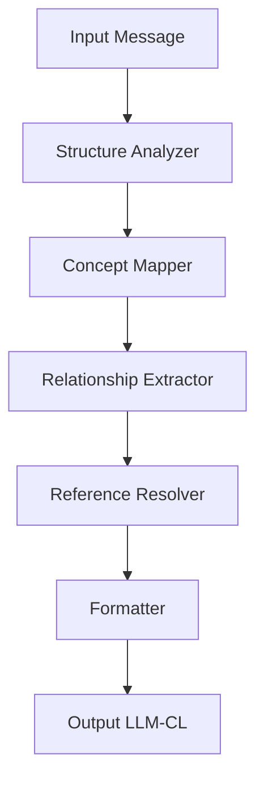

# LLM-CL: Prompt Engineering Implementation

This document provides concrete prompt templates, strategies, and best practices for implementing LLM-CL through effective prompt engineering. These templates enable current LLMs to encode and decode LLM-CL without requiring architectural changes or fine-tuning.

## 1. Prompt Design Principles

When designing prompts for LLM-CL encoding and decoding, these principles ensure optimal performance:

- **Context Preservation**: Include sufficient context to enable semantic mapping
- **Instruction Clarity**: Provide unambiguous instructions for encoding/decoding
- **Few-shot Learning**: Include examples demonstrating correct format transformations
- **Task Decomposition**: Break complex encoding/decoding into discrete steps
- **Guardrails**: Add verification steps to ensure output compliance
- **Bidirectional Context**: Maintain awareness of both source and target formats

## 2. Encoder Prompt Templates

### 2.1 Basic Encoder

```
You will convert natural language into LLM-CL format. Follow these steps precisely:

1. Identify the message type (request, statement, response, etc.)
2. Extract key concepts and map them to the Universal Concept Space
3. Identify relationships between concepts
4. Structure using LLM-CL syntax with proper tokens (#, ~, {}, ^, $)
5. Verify token efficiency and semantic completeness

EXAMPLE 1:
Natural language: "What are the three main approaches to artificial general intelligence research?"
LLM-CL: @v1.0{#request~information
  #topic{#c501~approaches #c142~agi #c4492~research}
  $quantity{3}
}

EXAMPLE 2:
Natural language: "The economic impacts of climate change include rising sea levels, crop failures, and infrastructure damage."
LLM-CL: @v1.0{#statement
  #c117~climate_change
  ~impact{#c2901~economic
    #list{
      #c5501~sea_levels $rising
      #c3429~crops $failure
      #c6721~infrastructure $damage
    }
  }
}

Convert the following natural language to LLM-CL:
[INPUT]
```

### 2.2 Advanced Encoder with Concept Mapping

```
You will encode natural language into LLM-CL, with special attention to accurate concept mapping.

Concept ID reference (partial):
- c142: artificial_intelligence
- c143: natural_intelligence
- c501: machine_learning
- c502: deep_learning
- c1425: democracy
- c2901: economics
- c4230: neural_networks
- c4492: research
- c5501: environment
- c6701: knowledge_representation

For each LLM-CL concept (#cXXX), select the most specific and accurate concept ID. If no existing ID matches, use descriptive labels instead.

EXAMPLES:
[Examples as in Basic Encoder]

Your goal is maximum token efficiency while preserving complete semantic meaning. Convert:
[INPUT]
```

### 2.3 Chain-of-Thought Encoder

```
You will convert natural language to LLM-CL format using explicit reasoning steps.

Step 1: Analyze the input to determine message type (request, statement, response)
Step 2: Extract key concepts and entities from the input
Step 3: Identify relationships between these concepts
Step 4: Map concepts to Universal Concept Space IDs where possible
Step 5: Organize into hierarchical structure with appropriate nesting
Step 6: Add precision modifiers and quantifiers as needed
Step 7: Format using correct LLM-CL syntax (@, #, ~, {}, ^, $)
Step 8: Verify completeness and efficiency

EXAMPLES:
[Detailed examples with step-by-step reasoning]

Now convert the following, showing your reasoning at each step:
[INPUT]
```

## 3. Decoder Prompt Templates

### 3.1 Basic Decoder

```
You will convert LLM-CL format into natural language. Follow these steps:

1. Parse the LLM-CL structure and identify message type
2. Expand concept IDs to their full semantic meaning
3. Interpret relationships between concepts
4. Resolve any references (^) to previous context
5. Apply appropriate language structure based on message type
6. Generate natural language that fully captures all semantic content

EXAMPLE 1:
LLM-CL: @v1.0{#request~information
  #topic{#c501~approaches #c142~agi #c4492~research}
  $quantity{3}
}
Natural language: "What are the three main approaches to artificial general intelligence research?"

EXAMPLE 2:
LLM-CL: @v1.0{#response~information
  #list{
    #item1{#c501~symbolic #c142
      ~has{#c2231~logic #c8701~rules}
    }
    #item2{#c501~connectionist #c142
      ~has{#c4230~neural_networks #c4231~deep_learning}
    }
    #item3{#c501~hybrid
      ~combines{^.#item1 ^.#item2}
    }
  }
}
Natural language: "The three main approaches to AGI research are: 1) Symbolic AI, which uses logic and rule-based systems; 2) Connectionist AI, which uses neural networks and deep learning; and 3) Hybrid approaches, which combine symbolic and connectionist methods."

Convert the following LLM-CL to natural language:
[INPUT]
```

### 3.2 Context-Aware Decoder

```
You will decode LLM-CL into natural language with awareness of conversation history.

CONTEXT HISTORY:
[Previous messages in conversation]

When you encounter reference tokens (^prev1, ^self, etc.), resolve them using the context history. Produce natural language that sounds fluent and conversational while preserving all semantic content from the LLM-CL input.

EXAMPLE:
[Example with references to previous context]

Convert to natural language:
[INPUT]
```

### 3.3 Specialized Domain Decoder

```
You will convert LLM-CL to natural language specialized for the [DOMAIN] domain.

For concepts related to [DOMAIN], use precise terminology and phrasing conventional to experts in this field. Maintain the complete semantic content while adapting language style to match expert communication in this domain.

DOMAIN-SPECIFIC CONCEPT MAPPINGS:
[Domain-specific concept mappings]

EXAMPLES:
[Domain-specific examples]

Convert the following LLM-CL to [DOMAIN]-appropriate natural language:
[INPUT]
```

## 4. Prompt Chaining for Complex Transformations

For complex messages, a chain of specialized prompts can be more effective than a single prompt:



### Implementation Example:

```python
def encode_complex_message(natural_language, model):
    # Step 1: Analyze structure
    structure_prompt = "Analyze the structure of this message, identifying main topics and message type: " + natural_language
    structure = model.generate(structure_prompt)
    
    # Step 2: Map concepts
    concept_prompt = f"Map the following concepts to the Universal Concept Space: {extract_concepts(structure)}"
    concept_mapping = model.generate(concept_prompt)
    
    # Step 3-5: Continue pipeline
    # ...
    
    # Final step: Format in LLM-CL syntax
    formatting_prompt = f"Format the following components into valid LLM-CL syntax:\n{compiled_components}"
    llm_cl = model.generate(formatting_prompt)
    
    return llm_cl
```

## 5. Error Correction and Validation

### 5.1 Syntax Validator Prompt

```
Verify if the following LLM-CL is valid according to specification. Check for:
1. Proper nesting of structural tokens {}
2. Correct use of token classes (#, ~, $, ^)
3. Valid version marker
4. Proper reference formats

If invalid, identify errors and provide corrections:
[LLM-CL to validate]
```

### 5.2 Round-Trip Validation Prompt

```
Perform a round-trip validation:
1. Convert the LLM-CL to natural language
2. Convert your natural language back to LLM-CL
3. Compare the original and round-trip LLM-CL
4. Identify any semantic loss or discrepancies

Original LLM-CL:
[Original LLM-CL]
```

## 6. Meta-Prompting Techniques

### 6.1 Self-Improvement Prompt

```
You previously converted natural language to LLM-CL with this result:
[Previous conversion]

Analyze your conversion and identify opportunities to:
1. Increase token efficiency
2. Improve semantic precision
3. Better capture the original meaning

Provide an improved version with explanation of changes:
```

### 6.2 Adaptation Learning Prompt

```
The following pairs show natural language and their correct LLM-CL encodings:
[5+ example pairs]

Study these examples to identify patterns in how concepts are mapped and structured. Then convert this new example using the same patterns:
[New input]
```

## 7. Specialized Use Case Prompts

### 7.1 Multi-Agent Communication

```
You are an agent in a multi-agent system communicating with other LLMs.

When receiving LLM-CL messages, decode them completely before formulating your response.
When sending messages, encode your response in LLM-CL for maximum efficiency.

Your role and capabilities:
[Role specification]

Incoming LLM-CL message:
[Input message]

Generate your response in both LLM-CL and natural language (for human observers):
```

### 7.2 Knowledge Distillation

```
You will encode complex knowledge into highly efficient LLM-CL format.

Original knowledge text:
[Complex knowledge text]

Create an LLM-CL representation that:
1. Preserves all key concepts and relationships
2. Structures information hierarchically
3. Includes confidence markers ($) where appropriate
4. Maximizes information-to-token ratio
```

## 8. Best Practices

### 8.1 Human-in-the-Loop Refinement
Use humans to evaluate and refine encoder/decoder outputs iteratively.

### 8.2 Progressive Complexity
Start with simpler messages before attempting to encode/decode complex ones.

### 8.3 Error Analysis
Regularly analyze failures to identify patterns and improve prompts.

### 8.4 Concept Space Augmentation
Continuously expand the concept space based on encoding gaps.

### 8.5 Context Management
Carefully track and update context for reference resolution.

## 9. Evaluation Metrics

Evaluate prompt effectiveness using:

- **Token Efficiency Ratio**: (Natural language tokens) / (LLM-CL tokens)
- **Semantic Preservation Score**: % of concepts and relationships preserved in round-trip conversion
- **Accuracy Rate**: % of encodings/decodings that meet specification
- **Inference Time**: Processing time required for encoding/decoding
- **Consistency Measure**: Variance in outputs across multiple runs

## 10. Prompt Template Library

A growing collection of specialized templates is available at:
[Link to template library]

These templates cover diverse domains and use cases, with documentation on when and how to apply each one.

## 11. Conclusion

These prompt engineering strategies enable efficient implementation of LLM-CL without model modifications. By using these templates and following the outlined best practices, developers can achieve significant improvements in LLM-to-LLM communication efficiency and precision.
